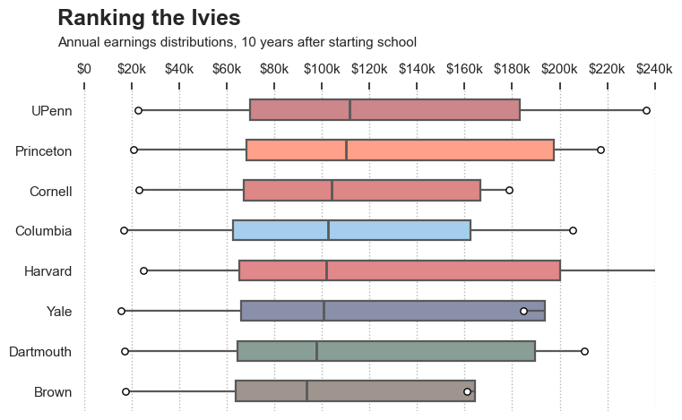
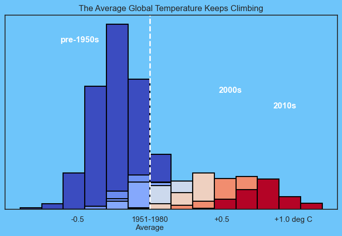

# Earnings & Climate Distribution Analysis

A Python visualization project examining distributions in two different real-world datasets: long-term graduate earnings and global temperature deviations.

The project emphasizes distribution-based visualization rather than relying only on averages.

## Technologies

- Python
- Pandas
- Matplotlib
- Seaborn
- Jupyter Notebook
- Distribution Analysis
- Data Transformation

## Ivy League Earnings Distribution

This visualization compares annual earnings distributions for Ivy League universities ten years after students began their studies.

Each institution is represented using multiple earnings percentiles, including the 10th, 25th, median, 75th, and 90th percentiles.

This provides more information than comparing institutions using median earnings alone.

### Techniques Demonstrated

- Percentile-based analysis
- Custom box-plot construction
- Sorting and ranking
- Currency formatting
- Comparative visualization

## Global Temperature Distributions by Decade

This visualization transforms monthly temperature measurements into decade-level distributions and compares how global temperature deviations have shifted over time.

The 1951–1980 average is used as the visual reference point.

### Techniques Demonstrated

- Wide-to-long data transformation
- Temporal grouping
- Histogram distributions
- Colour encoding by decade
- Reference-line visualization

## Data

The analysis uses:

- `college-earnings.csv`
- `temps.csv`

## Notebook

See [`analysis.ipynb`](analysis.ipynb) for the complete analysis and visualization code.
