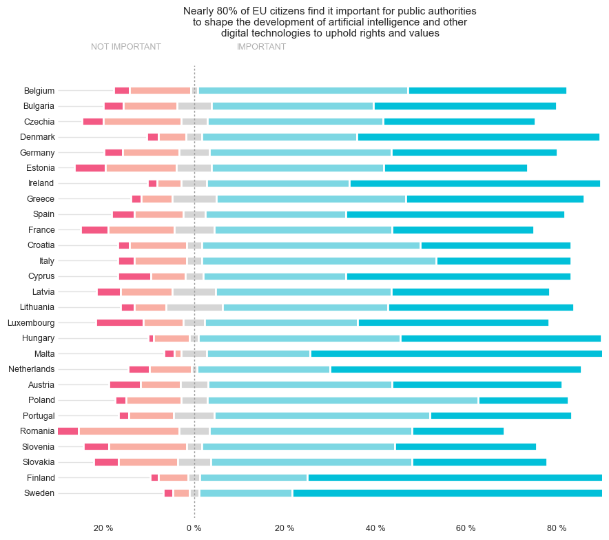

# AI Adoption & Gender Representation Visualization

A data visualization project examining public attitudes toward artificial intelligence across Europe and perceived gender representation in AI-generated occupational imagery.

The project demonstrates categorical comparison, diverging visualizations, and non-traditional waffle-chart design.

## Technologies

- Python
- Pandas
- Matplotlib
- Seaborn
- PyWaffle
- Jupyter Notebook
- Categorical Data Analysis

## European Public Opinion on AI

This diverging stacked-bar visualization compares responses across European countries regarding the importance of public authorities shaping artificial intelligence and other digital technologies to uphold rights and values.

Responses are separated around a central point to make positive and negative sentiment easier to compare.

### Techniques Demonstrated

- Percentage normalization
- Diverging stacked-bar charts
- Country-code mapping
- Categorical ordering
- Multi-category comparison

## Gender Representation Across Occupations

This waffle-chart visualization compares perceived gender representation in AI-generated imagery across fourteen occupations.

High-paying and lower-paying occupations are displayed side by side, allowing occupational differences in perceived gender representation to be visually compared.

One particularly strong pattern in the supplied data is the representation of engineers: all but two images associated with the keyword were categorized as perceived men.

### Techniques Demonstrated

- Waffle-chart visualization
- Small multiples
- Categorical comparison
- Custom annotations
- Multi-panel figure design

## Data

The analysis uses:

- `eu-ai.csv`
- `gen-ai.csv`

## Notebook

The complete implementation is available in [`analysis.ipynb`](analysis.ipynb).
