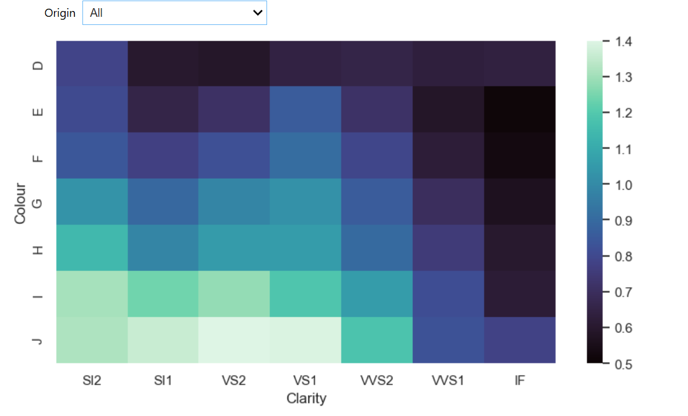

# Interactive Data Visualization Explorer

An interactive Python data-visualization project that allows users to dynamically explore two real-world datasets: diamond characteristics and historical baby-name popularity.

Unlike the static visualizations in the rest of this portfolio, this project uses interactive Jupyter widgets that allow users to change filters and immediately update the displayed visualization.

## Technologies

- Python
- Pandas
- Matplotlib
- Seaborn
- ipywidgets
- Jupyter Notebook
- Interactive Data Visualization
- Data Filtering
- Pivot Tables
- Time-Series Visualization

---

## Interactive Diamond Carat Heatmap

This visualization explores the relationship between diamond **color**, **clarity**, and average **carat size** using an interactive heatmap.

A dropdown control allows the user to dynamically compare:

- Natural diamonds
- Lab-grown diamonds
- All diamonds

The underlying data is filtered based on the selected diamond origin before being reorganized into a pivot table and visualized as a heatmap.

### Skills Demonstrated

- Interactive dropdown controls
- Dynamic data filtering
- Pandas pivot tables
- Categorical data analysis
- Heatmap visualization
- Data aggregation
- Seaborn visualization

---

## Baby-Name Popularity Explorer

This interactive visualization explores changes in baby-name popularity rankings between **1996 and 2020**.

Users can:

- Switch between boy and girl names
- Enter up to six names to compare
- Track how selected names change in popularity over time
- Compare selected names against the broader naming landscape

The chart dynamically updates whenever the selected gender or list of names changes.

Selected names are visually emphasized while other popular names remain in the background for context.

### Skills Demonstrated

- Interactive text input
- Toggle controls
- Dynamic chart updates
- Time-series visualization
- User-selected filtering
- Multi-series plotting
- Historical ranking analysis
- Visual highlighting and context

---

## Interactive Features

The PNG images above show representative states of each visualization.

The complete project remains interactive inside the Jupyter notebook. When the notebook is run, users can modify the controls and generate different views of the datasets in real time.

### Diamond Explorer

Users can change the diamond origin using a dropdown menu:

`Natural` • `Lab` • `All`

### Baby-Name Explorer

Users can select:

`Boy Names` • `Girl Names`

and enter multiple names to compare their historical rankings.

---

## Data

The project uses the following datasets:

- `diamonds.csv`
- `names.csv`
