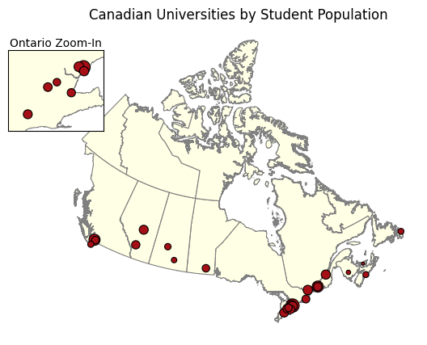
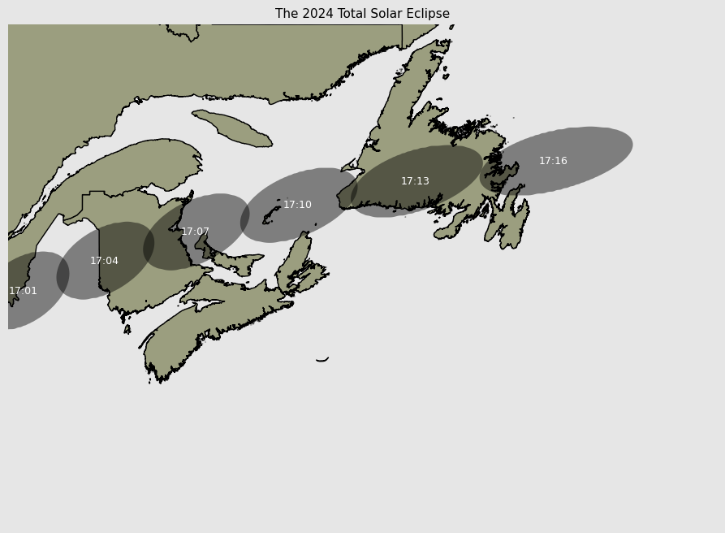
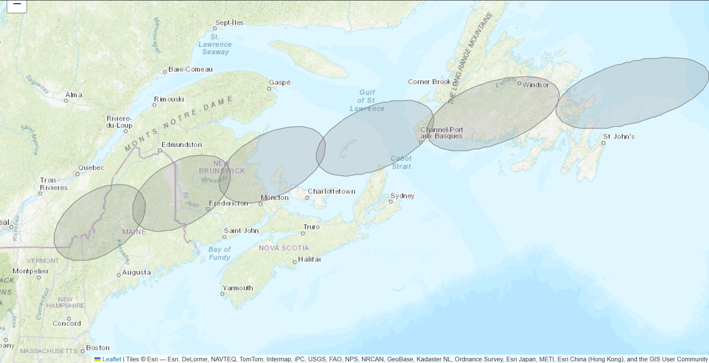

# Canadian Geospatial & Solar Eclipse Visualization

A geospatial data-analysis project using Canadian geographic datasets to visualize university populations and the path of the 2024 total solar eclipse.

The project combines static GIS visualization with an interactive web map.

## Technologies

- Python
- Pandas
- GeoPandas
- Matplotlib
- Folium
- GeoJSON
- Shapefiles
- Coordinate Reference Systems
- Geospatial Analysis

## Canadian Universities by Student Population

This map displays Canadian universities geographically, with marker size representing total student population.

A dedicated Southern Ontario inset provides additional detail in an area where several major universities are geographically concentrated.

### Techniques Demonstrated

- Shapefile processing
- GeoJSON data
- Coordinate-reference-system alignment
- Proportional-symbol mapping
- Geographic inset visualization

## 2024 Total Solar Eclipse

This static geospatial visualization overlays six positions of the 2024 total solar eclipse shadow across Eastern Canada.

UTC timestamps from the source data are converted to Newfoundland local time before being displayed on the map.

### Techniques Demonstrated

- Geographic reprojection
- Spatial overlays
- Time-zone transformation
- Polygon visualization
- Geographic annotation

## Interactive Eclipse Map

The eclipse data is also presented using an interactive Folium map with an ESRI World Topographic basemap.

Individual eclipse-shadow geometries are rendered as interactive geographic layers with local-time tooltips.

### Techniques Demonstrated

- Folium web mapping
- Interactive GeoJSON layers
- EPSG:4326 reprojection
- Map bounds and viewport control
- Geographic tooltips

## Geographic Data

The project uses:

- Canadian boundary shapefiles
- University GeoJSON data
- Eclipse umbra shapefiles

Shapefile companion files are kept together in the project directory so the geographic datasets can be loaded correctly.

## Notebook

The complete geospatial analysis is available in [`analysis.ipynb`](analysis.ipynb).
