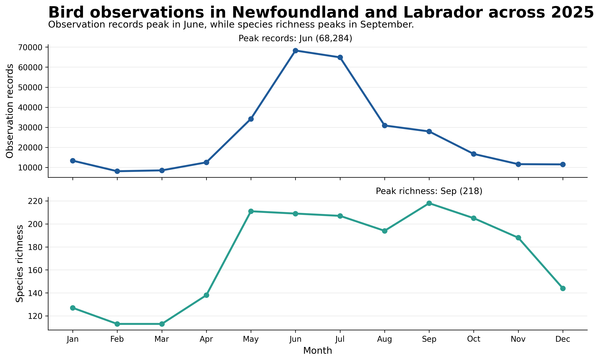
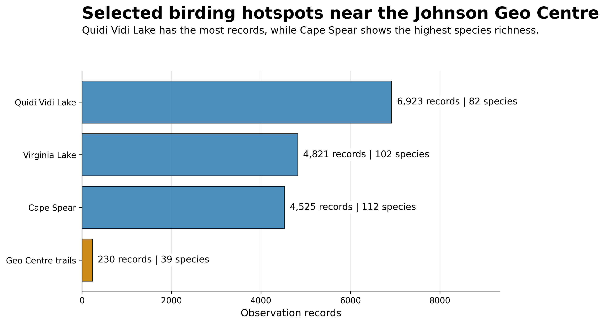
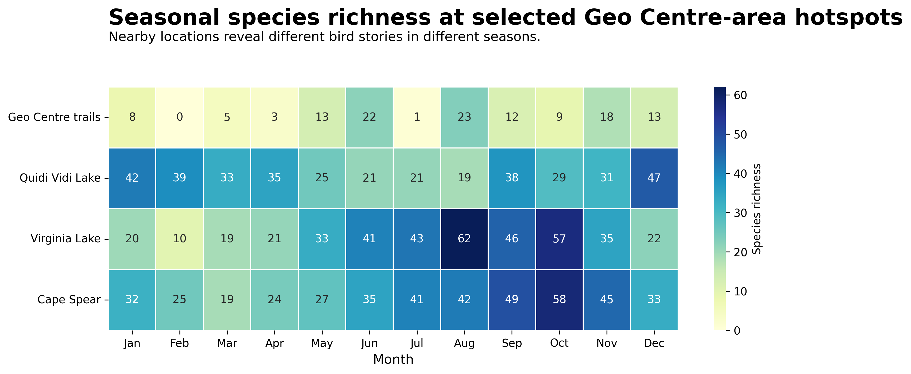

# Newfoundland Bird Biodiversity Analysis

A data-analysis and visualization project examining seasonal bird activity, species richness, and observation hotspots across Newfoundland and Labrador.

The analysis combines province-wide temporal patterns with detailed comparisons of selected birding locations near the Johnson Geo Centre in St. John's.

## Technologies

- Python
- Pandas
- NumPy
- Matplotlib
- Seaborn
- Jupyter Notebook
- Temporal Analysis
- Data Aggregation
- Heatmap Visualization

## Province-Wide Seasonality

Monthly observation records and unique-species counts are compared across 2025.

The analysis shows that observation activity and biodiversity do not peak during the same month:

- Observation records peak in **June**
- Species richness peaks in **September**

This demonstrates the difference between the volume of observations and the diversity of species being observed.

## Birding Hotspot Comparison

Four selected locations around the St. John's area are compared using both total observation records and species richness:

- Geo Centre trails
- Quidi Vidi Lake
- Virginia Lake
- Cape Spear

Within the analyzed data, **Quidi Vidi Lake has the highest number of observation records**, while **Cape Spear has the highest species richness**.

## Seasonal Species Richness

The heatmap compares monthly species richness across the four selected locations.

This provides a more detailed view of how biodiversity changes not only by location, but also by season.

### Techniques Demonstrated

- Date parsing
- Data cleaning
- Grouped aggregation
- Unique-value analysis
- Temporal analysis
- Comparative bar charts
- Heatmap visualization
- Data-driven annotation

## Data

The analysis uses:

- `birds.csv`

## Notebook

The complete data preparation, aggregation, analysis, and visualization code is available in [`analysis.ipynb`](analysis.ipynb).
