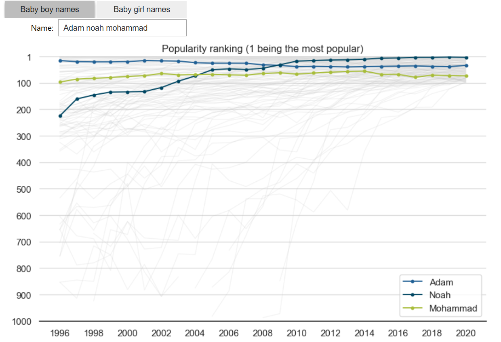
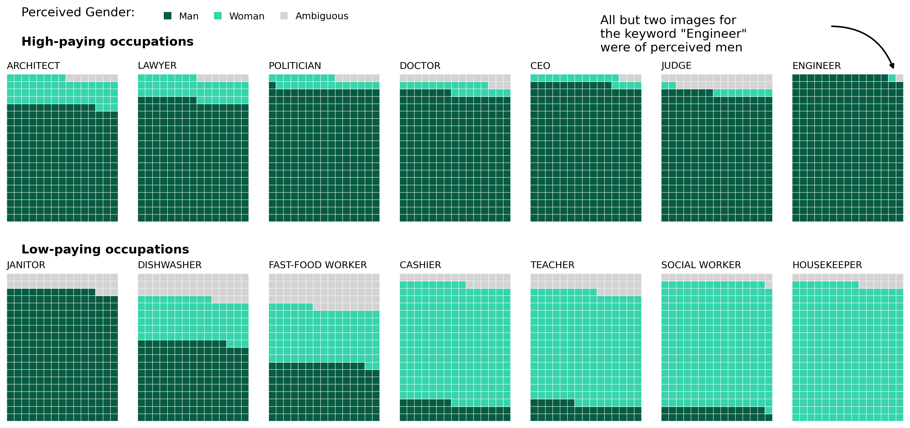
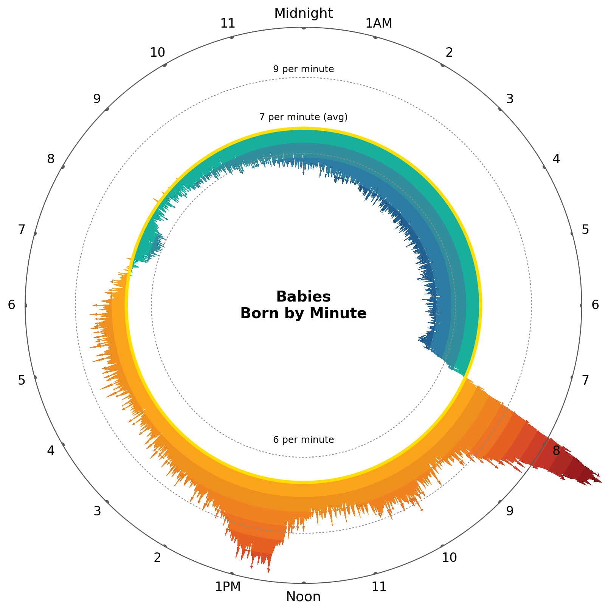
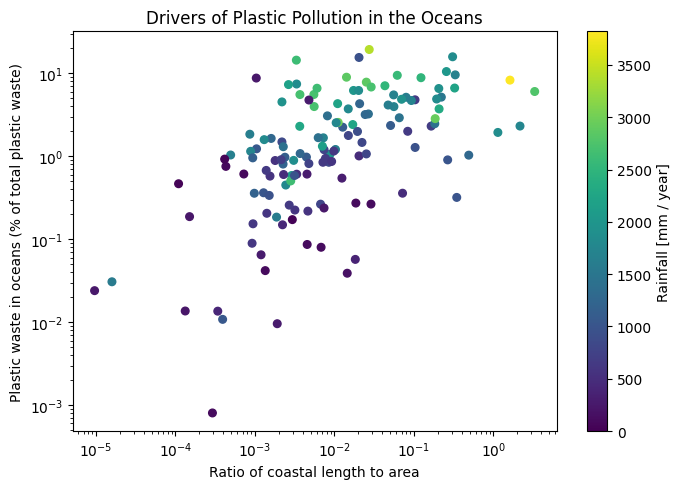

# Data Visualization Portfolio

A collection of seven Python data analysis and visualization projects exploring geographic, temporal, environmental, demographic, biological, and technology-focused datasets.

This portfolio demonstrates the process of transforming raw data into meaningful visual communication through data cleaning, aggregation, exploratory analysis, interactive visualization, statistical analysis, and geospatial techniques.

## Technical Skills

**Languages & Analysis:** Python, Pandas, NumPy

**Visualization:** Matplotlib, Seaborn, PyWaffle

**Interactive Visualization:** ipywidgets, Folium

**Geospatial:** GeoPandas, GeoJSON, Shapefiles, Coordinate Reference Systems

**Techniques:** Data Cleaning, Exploratory Data Analysis, Temporal Analysis, Distribution Analysis, Interactive Filtering, Data Aggregation, Geospatial Visualization

---

# Projects

## Newfoundland Bird Biodiversity Analysis


Analyzed 2025 bird-observation data across Newfoundland and Labrador to identify seasonal patterns, species richness, and differences between major birding hotspots.

The analysis compares province-wide observation activity with species diversity and investigates selected locations around St. John's, including Geo Centre trails, Quidi Vidi Lake, Virginia Lake, and Cape Spear.

The results show that observation records peak in **June**, while species richness peaks in **September**, demonstrating that observation volume and biodiversity do not necessarily follow the same seasonal pattern.

**Technologies:** Python · Pandas · NumPy · Matplotlib · Seaborn · Temporal Analysis

[View Project →](07-newfoundland-bird-biodiversity/)

---

## Canadian Geospatial & Solar Eclipse Visualization


Developed static and interactive geographic visualizations using Canadian shapefiles, university GeoJSON data, and geographic data describing the path of the 2024 total solar eclipse.

The project includes coordinate-system transformations, proportional-symbol mapping, geographic overlays, time-zone conversion, and interactive web mapping.

An interactive Folium implementation allows eclipse-shadow geometries to be explored directly through geographic layers and tooltips.

**Technologies:** Python · GeoPandas · Folium · Matplotlib · GeoJSON · GIS

[View Project →](06-canada-geospatial-eclipse/)

---

## Interactive Data Visualization Explorer



Built interactive visualizations that allow users to dynamically explore diamond characteristics and historical baby-name popularity.

The diamond visualization uses interactive filtering to compare natural, lab-grown, and combined diamond datasets through dynamically generated heatmaps.

The baby-name explorer allows users to select gender and enter multiple names to compare how their popularity rankings changed between 1996 and 2020.

**Technologies:** Python · Pandas · Matplotlib · Seaborn · ipywidgets

[View Project →](05-interactive-data-explorer/)

---

## AI Adoption & Gender Representation



Visualized European public attitudes toward artificial-intelligence governance and explored perceived gender representation across occupations in AI-generated imagery.

The project combines a diverging stacked-bar visualization for comparing attitudes across European countries with a multi-panel waffle visualization examining perceived gender representation across different occupations.

**Technologies:** Python · Pandas · Matplotlib · Seaborn · PyWaffle

[View Project →](03-ai-adoption-gender-bias/)

---

## Birth Patterns Through Time



Transformed birth timestamps into a circular 24-hour visualization representing all **1,440 minutes of the day**.

The visualization uses a polar coordinate system to reveal how birth frequency changes throughout the day, with visual encoding distinguishing periods above and below the overall average.

**Technologies:** Python · Pandas · NumPy · Matplotlib · Temporal Analysis · Polar Visualization

[View Project →](04-birth-time-patterns/)

---

## Earnings & Climate Distribution Analysis


Explored statistical distributions using two different real-world datasets: long-term graduate earnings across Ivy League universities and global temperature deviations across decades.

The earnings analysis compares multiple income percentiles rather than relying on a single average, while the climate analysis examines how temperature distributions have shifted over time.

**Technologies:** Python · Pandas · Matplotlib · Seaborn · Distribution Analysis

[View Project →](02-earnings-climate-visualization/)

---

## Environmental & Health Data Visualization



Explored environmental and health datasets through visualizations examining potential drivers of ocean plastic pollution and recommended sleep-duration ranges across age groups.

The project demonstrates multivariable visualization, logarithmic scaling, range-based visualization, data transformation, and exploratory analysis.

**Technologies:** Python · Pandas · Matplotlib · Exploratory Data Analysis

[View Project →](01-environment-health-visualization/)

---

# Repository Structure

Each project is stored in its own directory and contains its notebook, source datasets, README, and generated visualization files.

```text
Data-Visualization-Portfolio/
│
├── README.md
│
├── 01-environment-health-visualization/
│   ├── README.md
│   ├── analysis.ipynb
│   ├── river-plastics.csv
│   ├── sleep.csv
│   ├── plastic-pollution-drivers.png
│   └── recommended-sleep-by-age.png
│
├── 02-earnings-climate-visualization/
│   ├── README.md
│   ├── analysis.ipynb
│   ├── college-earnings.csv
│   ├── temps.csv
│   ├── ivy-league-earnings-distribution.png
│   └── global-temperature-distributions-by-decade.png
│
├── 03-ai-adoption-gender-bias/
│   ├── README.md
│   ├── analysis.ipynb
│   ├── eu-ai.csv
│   ├── gen-ai.csv
│   ├── eu-ai-public-opinion.png
│   └── occupational-gender-perception.png
│
├── 04-birth-time-patterns/
│   ├── README.md
│   ├── analysis.ipynb
│   ├── births.csv
│   └── births-by-minute-circular.png
│
├── 05-interactive-data-explorer/
│   ├── README.md
│   ├── analysis.ipynb
│   ├── diamonds.csv
│   ├── names.csv
│   ├── diamond-carat-heatmap.png
│   └── baby-name-popularity-explorer.png
│
├── 06-canada-geospatial-eclipse/
│   ├── README.md
│   ├── analysis.ipynb
│   ├── geographic data files
│   ├── canadian-universities-map.png
│   ├── solar-eclipse-static-map.png
│   └── solar-eclipse-interactive-map.png
│
└── 07-newfoundland-bird-biodiversity/
    ├── README.md
    ├── analysis.ipynb
    ├── birds.csv
    ├── nl-bird-observation-seasonality.png
    ├── nl-birding-hotspot-comparison.png
    └── nl-bird-species-richness-heatmap.png
